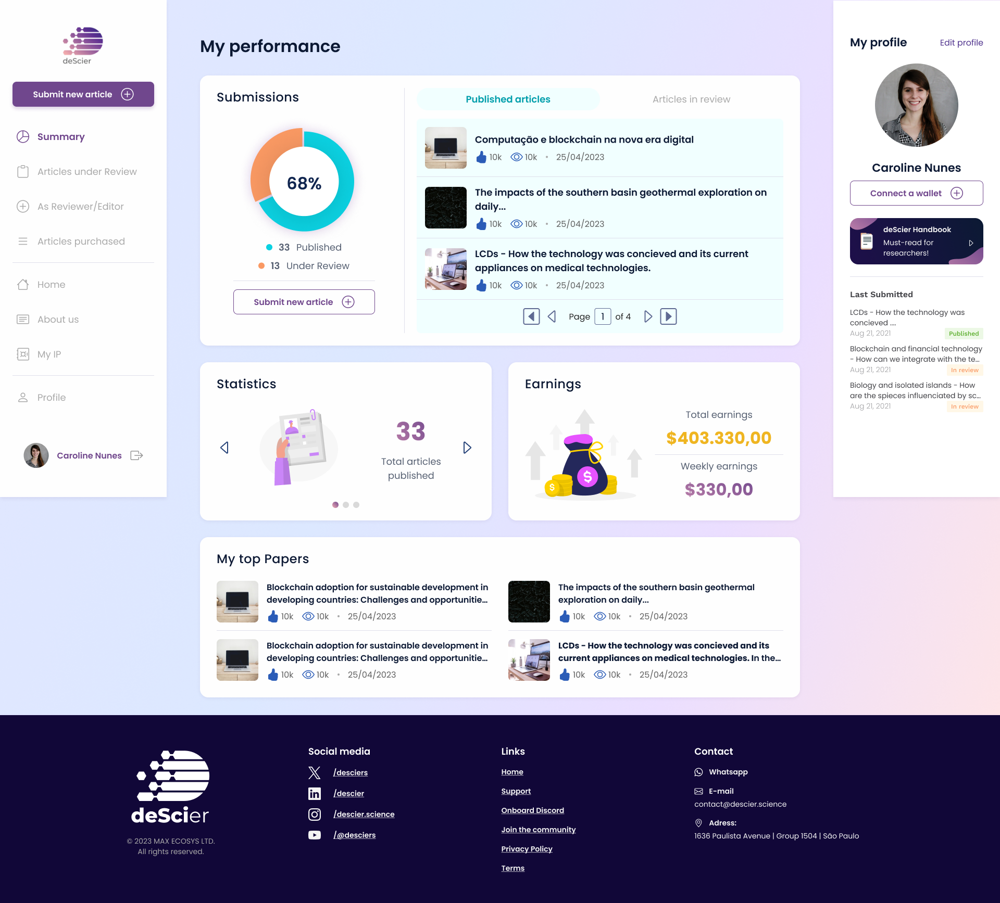

<h1 align="center">
  
</h1>
  <p align="center">The deScier project represents an innovation in scientific publishing, making it more accessible, faster, and fairer. Our decentralized approach increases transparency and empowers authors, ensuring 100% ownership and control over their work while significantly reducing costs. Our differentiator includes unique peer review processes and advanced technologies, promoting global collaboration and unprecedented co-creation. With deScier, we democratize access to scientific publishing, driving the advancement of knowledge on a global scale and demonstrating the efficiency and benefits of our approach compared to traditional methods.</p>
<h4 align="center">
 <p align="center">
   
   
   
   
</p>
</h4>



## Introduction

The **[deScier – Decentralized Science](https://desci.reviews)** is a revolutionary decentralized science publishing platform that empowers researchers, scientists, and scholars worldwide. We believe in transforming how scientific research is conducted, shared, and funded through blockchain technology and decentralized systems.

## Our Mission

We create cutting-edge solutions that break down barriers in traditional science by leveraging blockchain technology and decentralized systems. Our mission is to democratize scientific discovery, enhance transparency, and foster global collaboration, making research more accessible, equitable, and impactful for citizens, scientists, scholars, students, and communities worldwide.

## Core Values

- **Publish Easily**: Streamlined submission process that removes bureaucratic barriers and complex procedures
- **Publish Economically**: Affordable publishing costs that make scientific publication accessible to researchers worldwide
- **Peer Reviewed Quality**: Rigorous review process ensuring the highest standards of scientific excellence
- **100% Retained Copyright**: Authors maintain complete ownership and control over their intellectual property
- **Constructive Feedback**: Expert guidance and mentorship throughout the publication process
- **Impact Metrics**: Real-time tracking of research influence and community engagement

## Features

- **Scientific Document Submission System**: An intuitive platform for scientists to submit their work with streamlined workflows and real-time tracking

- **Decentralized Peer Review**: A transparent, blockchain-based review system where expert reviewers provide constructive feedback and are fairly compensated for their expertise

- **Role-Based Access Control**: Customized interfaces for authors, reviewers, editors, and administrators, each optimized for their specific workflows and responsibilities

- **Open Access Library**: A comprehensive repository of scientific articles with both free and premium content, promoting global knowledge sharing

- **Blockchain-Powered Publishing**: Smart contracts ensure transparent processes, immutable records, and automatic royalty distribution to authors

- **Community Governance**: Decentralized decision-making through token-based voting, ensuring the platform evolves according to community needs

## Cloning the repository and runing locally

Clone the repository by running the following command in your terminal:

```console
git clone https://github.com/GoretiFreitas/deSci-platform.git
```

Once the repository is cloned, navigate to the project folder using the terminal and install the project dependencies:

    pnpm install

After the installation is complete, you can start the local development server:

    pnpm run dev

Open your web browser and visit http://localhost:3000 to see the result. The application should be up and running locally on your machine.

I recommend using the **[Inline Fold](https://marketplace.visualstudio.com/items?itemName=moalamri.inline-fold)** extension for Visual Studio Code when working with Tailwind CSS in this project. This extension allows for a cleaner and more organized view when multiple Tailwind CSS classes are used on a single element.

## Setting the environment variables

Before running the project you need to set up environment variables. Create a .env file at the root directory and add the following variables:

```
NEXT_PUBLIC_NODE_ENV=<your-env>
NEXT_PUBLIC_API_URL=<your-api-url>
NEXT_PUBLIC_BASE_URL=<your-base-url>
NEXT_PUBLIC_GOOGLE_SITE_VERIFICATION=<your-google-site-verification>
NEXTAUTH_SECRET=<your-secret> # Generate using `jose newkey -s 512 -t oct -a HS512` ou `openssl rand -base64 32`
NEXTAUTH_URL=<your-nextauth-url>

GOOGLE_ID=<your-google-id>
GOOGLE_SECRET=<your-google-secret>

WEB3AUTH_CLIENT_ID=<your-web3auth-client-id>
WEB3AUTH_CLIENT_ID_TEST=<your-web3auth-client-id-test>

ALCHEMY_API_URL=<your-alchemy-api-url>
ALCHEMY_API_URL_TEST=<your-alchemy-api-url-test>
```
